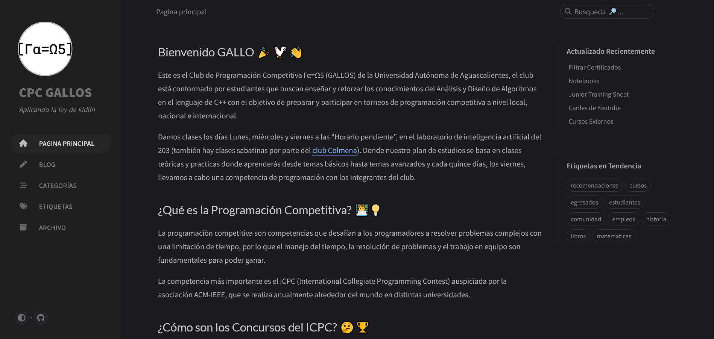

<!-- _class: cover_e -->
<!-- _paginate: "" -->
<!-- _footer:  -->
<!-- _header:  -->

# <!-- fit -->Course introduction

###### For competitive programming 

by Ariel Parra

## Who are we?

<!-- _class: cols-2 -->

The Competitive Programming Club Γα=Ω5 (CPC-GALLOS) from the Universidad Autónoma de Aguascalientes (UAA). It is composed exclusively of students who seek to teach and reinforce knowledge of Algorithm Analysis and Design with the goal of participating in programming tournaments at local, national, and international levels primarily, but we don't just program in this club - we also aspire to strengthen your skills and support you in your <strong>professional development</strong>, providing resources and opportunities to advance in your career such as courses, scholarships, and certifications.

<!-- Comentar que evidentemente si no saben inglés aqui pueden aprender y si si saben inglés aqui reforzaran la comprensión lectora y el speaking -->

## What is Competitive Programming?

<!-- _class: cols-2-64 -->

Competitive programming is the combination of algorithm design along with its implementation to solve specific problems efficiently within a given time frame.

This comes together with teamwork when in competitive programming contests participants apply their knowledge of algorithms to solve a set of logical and mathematical problems while distributing the different tasks among themselves.

## What is Algorithmics (Algoritmia)? 

Algorithmics (Algoritmia in spanish) is the science that studies algorithms, where an algorithm is understood as a series of instructions and operations that allow solving a problem. Problems in algorithmics are characterized by having a set of input data and expected results.

This analysis can be represented through the

graph LR;
    A[PROBLEM: Input Data]
    B[SOLUTION: Expected Output]
    A --> B

## What is Kidlin's Law?

We are not referring to Kidlin's law of confidential information protection in law firms, but to the fictional character from the novel King Rat written by James Clavell. Where Kidlin's approach to solving life's challenges led to the development of a law that states:

> “If you write the problem down clearly, then the matter is half solved.”

  <!-- siempre es bueno recordar esta frase cuando resolvemos problemas, ya que el primer paso es comprenderlo -->

## Problem Example

What is the minimum number of these L-shaped tetrominoes needed to form a square?

 
<!-- 3 minutos maximo para resolverlo, al final preguntar cuantos pudiern, el objetivo de este ejercicio no es obtener la respuesta o humillar a quien no sepa, ya que en si la pregunta puede ser ambigua en si, el punto es el analizar el proceso mental de analisis de un problema y como buscar para llegar a su solucion. -->

## Contests

<!-- _class: cols-2 -->

<mark>ICPC</mark> (International Collegiate Programming Contest). This is the most important competitive programming competition worldwide, sponsored by the ACM-IEEE association. It is held annually around the world in 3233 universities in 110 countries across 6 continents. In Mexico, the ICPC is hosted at ITESO university. Participating in this competition is the **main objective** of the club. It takes place throughout each year, usually starting in the **month of May** in-person at UAA.
<mark>Meta Hacker Cup</mark> is Facebook's annual competition held in **October**, this one is online.
<mark>CoderBloom</mark> is a competition aimed at women held **monthly** with different categories and prizes.

---
<!-- _class: cols-2 -->

<mark>ANIEI National Programming Contest</mark> The National Association of Educational Institutions in Information Technologies (ANIEI) holds this contest in alliance with ICPC Mexico in the month of **October**.

<mark>IEEEXtreme</mark> is a 24-hour programming competition organized by IEEE in the month of October.

<mark>RPC</mark> (Red de Programación Competitiva) are contests focused on the Latin American community, they usually have mirrors of

> Más información en el blog [cpc-gallos.github.io/blog/Concursos](https://cpc-gallos.github.io/blog/Concursos/)

## Competitive Programming Platforms 
<mark> [Codeforces](https://codeforces.com/)</mark> is a platform developed by programmers from ITMO University in Russia. This is the platform that **we will use in the course** because it is the most popular among the ICPC community, where after each contest we can access a gym with the contest problems. Codeforces has a large number of problems to solve and has multiple contests each month.
<mark>[CSES](https://cses.fi/problemset/)</mark>: Offers a limited but high-quality list of algorithm and data structure problems that help improve problem-solving skills.
<mark>[AtCoder](https://atcoder.jp/)</mark> is a platform similar to Codeforces but without issues and from Japan where multiple weekly contests take place.
<mark>[LeetCode](https://leetcode.com/contest/)</mark> is a platform focused mainly on technical job interviews, so the problems there are more technical. If you want to apply to a company like the 'FAANG', I recommend practicing here. They have multiple contests weekly.
<!-- Leetocode son problemas para FAANG: Facebook Apple Amazon Netflix Google -->
<mark>[HackerRank](https://www.hackerrank.com/contests)</mark> is a platform that has weekly contests not necessarily focused on competitive programming, where they also have courses and exams on different skills and technologies.

## Homework

1. Create an account on codeforces
2. Create an account on CSES
3. Read the CPC-GALLOS blog 

## Our blog: cpc-gallos.github.io

Here you will find a lot of information about competitive programming such as books, courses from other universities, Discord communities and also about topics different from competitive programming such as professional development, internships, offers in certifications, **job opportunities** and much more.

## References

- Aprende Programación Competitiva. (2019). *Introducción a la algoritmia (I): Eficiencia*. https://aprende.olimpiada-informatica.org/algoritmia-introduccion-1-eficiencia
- Code_Report. (2018). *Difference between HackerRank, LeetCode, Topcoder and Codeforces* [Video]. YouTube. https://www.youtube.com/watch?v=J267bz_G7xE
- Haro, C. (2021). *Algoritmia: Razonar para crear*. Ediciones ENI. https://www.ediciones-eni.com/libro/algoritmia-razonar-para-crear-9782409031502/que-es-la-algoritmia
- Real Academia Española. (2024). *Diccionario de la lengua española* (23.ª ed.). https://dle.rae.es/algoritmia
