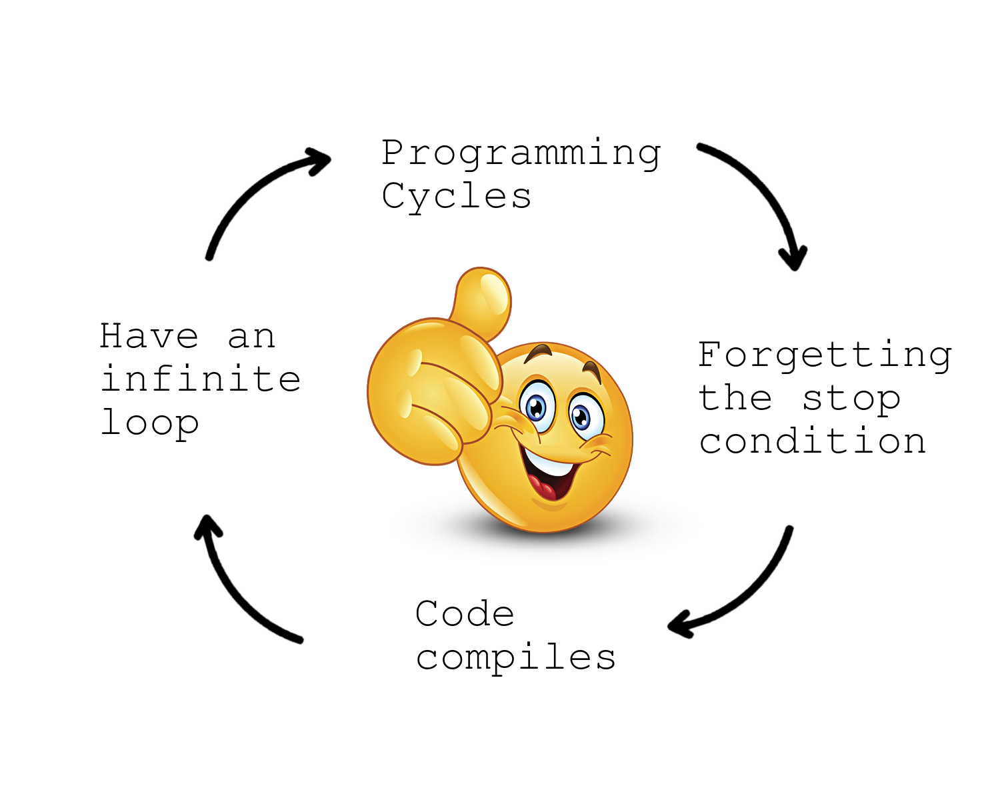

<!-- _class: cover_b -->
<!-- _paginate: "" -->
<!-- _footer: "" -->

# Syntax and Control Flow
###### Of Python3 and C++


By Ariel Parra

## Simplest Python Template for input output program

```py
def main():
    
    n = int(input()) # delcares a variable 'n' and asign an integer from standart input
    print(n) # writes the variable 'n' followed by a newline '\n' to standart output

main() # calls the main function to run
```


## Simple Python Template for competitive programming

```py
import sys # imports fast input/output library 
read = sys.stdin.readline # fast input function
write = sys.stdout.write # fast output function

def main():
    
    n = int(read()) # delcares a variable 'n' and asign an integer from standart input
    write(f"{n}\n") # writes the variable 'n' followed by a newline '\n' to standart output

main() 
```

<!-- Recordar el write = sys.stdout.write ya que no se volvera a repetir y se asumira en lugar de print para ejemplos -->

> Try the code on https://www.onlinegdb.com/

<!-- mencionar que la parte del codigo que nos interesa es el algoritmo en si, el read y el write -->

## Simple C++ template for competitive programming 
```c++
#include <bits/stdc++.h> // includes all librarys in c++
using namespace std; // std::cout<<"hi"; -> cout<<"hi"; 

int main(){
ios::sync_with_stdio(0);cin.tie(0); // enables fast input/output

    int n;       // variable to store the input number
    cin >> n;    // reads an integer 'n' from standard input
    cout << n;   // writes the integer to standard output

return 0;
}
```

## Conditionals


<!-- El chiste es que conditional suena similar a conditioner -->

###  Truth Tables for Boolean (Logical) Operators

<!-- _class: cols-3 -->

<div class="ldiv center">

#### Py `not`, C++`!` 

| p | ¬p |
|---|----|
| F | T  |
| T | F  |
</div>

<div class="mdiv center">

#### Py `and`, C++ `&&`

| p | q | p ∧ q |
|---|---|-------|
| F | F | F     |
| F | T | F     |
| T | F | F     |
| T | T | T     |
</div>

<div class="rdiv center">

#### Py `or`, C++ `||`

| p | q | p ∨ q |
|---|---|-------|
| F | F | F     |
| F | T | T     |
| T | F | T     |
| T | T | T     |
</div>

<!-- F = False, T = True -->

### simple if's


Python
```py
programming, studying = True, True
if programming:
    write("True\n")  # output with endline '\n'
else:
    write("False\n")
```
C++
```c++
bool programming, studying = true;
if(programming) //asumes if(programming == true) 
    cout << "true\n"; // output with endline '\n'
else //asume if(programming == false) or if(!programming)
    cout << "false" << endl; // output with endl  
```

### Ternary operator

First, the boolean condition is written, followed by the `?` operator, which indicates the value that will be returned if the condition is true. After the `:` operator, the value that will be returned if the condition is false is placed.

py
```py
write("Learning " if programming else "procrastinating") # Py
```
c++
```c++
cout << (programming ? "Learning " : "procrastinating"); //C++
```
```c++
cout << (programming && studying ? "I will succeed in competitions"
 : (programming || studying ? "maybe I will succeed" : "well I won't succeed"));
```

<!-- En el ultimo snippet de código preguntar cuales serian los resultados cuando programming -->

### Switch-case in c++

It allows evaluating an expression and executing different code blocks efficiently. In this case, `a` is the evaluated expression and can only be numeric (`int` / `long long`) or a character (`char`). Note that Python doesn't have a switch-case statement, so you would need to use if-else statements instead.

```c++ 
switch(a) { 
    case 'A': case '1':
        cout << "just chars 'A' and '1'";
        break;
    case 'a' ... 'z': 
        cout << "lowercase lettters"; 
        break; 
    case 0 ... 10:
        cout << "numbers 0 to 10"; 
        break;
    default:
        cout << "everything else";
} 
```

## Cycles



### for

- traditional for
```py
for i in range(n):
    write(f"{i} ")
```
```c++
for (int i=0; i < n; ++i) {
    cout << i << " ";
}
```

> **Output if n=10**: 0 1 2 3 4 5 6 7 8 9 

---

<style scoped>
pre {
    margin: 0;
    padding: 16px;
}
</style>

- single-line for 
```c++
for (int i=0; i < n; ++i) cout << i << " ";
```
```py
[write(f"{i} ") for i in range(n)]
```
- range for
```c++
vector<int> numbers = {1, 2, 3, 4, 5};
for (int number : numbers) {
    cout << number << " ";
}
```
```py
numbers = [1, 2, 3, 4, 5]
for number in numbers:
    write(f"{number} ")
```

### while

- while 
```py
i = 0
while True:  # condition
    write(f"{i}")
    i += 1
    if i > n:
        break  # instead of true
```
```c++
int i = 0;
while (true) { // condition
    cout << i;
    if (i++ > n) break; //insted of true contition
}
```

<!-- explicar que el while no parara con true -->

---

- do-while (Python doesn't have do-while)
```py
i = 0
write("\n")
while True:
    i += 1
    write(f"{i}")
    if not (i < n):
        break
```
```c++
int i = 0;
cout<<endl;
do {
    cout << ++i;
} while (i < n);
```
## Math sequences

<!-- Aquí los ejemplos seran en c++ y ya si quieren python que pregunten a chatpgt xD -->

#### arithmetic sequence
<!-- Progreción aritmetica en español -->


for example: 5,8,11,14,...
py
```py
a, d, n = 5, 3, 10
for i in range(n):
    write(f"{a + i * d} ")  # prints all until n term
```
c++
```c++
int a = 5, d = 3, n = 10; 
for (int i = 0; i < n; ++i) { 
    cout << a + i * d << " ";//prints all until n term
}
```

---

#### geometric sequence

for example: 5,15,45,135,...

```py
a, r, n = 5, 3, 10
for i in range(n):
    write(f"{a * (r ** i)} ")  # prints all until n term
```

```c++
int a = 5, r = 3, n = 10;
for (int i = 0; i < n; ++i) {
   cout << a * pow(r, i) << " "; // prints all until n term
}
```

<!-- explicar cada funcion -->
### Arithmetic sequences
<style scoped>
pre {
    margin: 0;
    padding: 16px;
    font-size: 17.5px;
}
</style>
<!--
a_n is the nth term. / a_n es el término n-ésimo.
a_1 is the first term. / a_1 es el primer término.
n is the term number. / n es el número del término.
d is the common difference. / d es la diferencia común.
-->

- **Formula for the nth term:**
$$ a_n = a_1 + (n - 1) \cdot d $$
```c++
   int an = a1 + (n - 1) * d;
```

- **Formula for the sum of the first n terms:**

$$ S_n = \frac{n}{2} \cdot (2a_1 + (n - 1) \cdot d) $$

```c++
    int sn = ( n * (2 * a1 + (n - 1) * d) ) /2;
```
- or equivalently:

$$ S_n = \frac{n}{2} \cdot (a_1 + a_n) $$

### Geometric sequences

<!--
a_n is the nth term. / a_n es el término n-ésimo.
a_1 is the first term. / a_1 es el primer término.
n is the term number. / n es el número del término.
r is the common ratio. / r es la razón común.
-->

<style scoped>
pre {
    margin: 0;
    padding: 16px;
}
</style>

- **Formula for the nth term:**

$$ a_n = a_1 \cdot r^{(n - 1)} $$

```c++
    int an = a1 * pow(r, n - 1);
```

- **Formula for the sum of the first n terms:**

For `r != 1`:

$$ S_n = a_1 \cdot \frac{1 - r^n}{1 - r} $$

```c++
    int Sn = a1 * (pow(r, n) - 1) / (r - 1);
```

- **Formula for the sum of an infinite geometric series (when `|r| < 1`):**

$$ S = \frac{a_1}{1 - r} $$

## Summation / Sumatorias (Σ)

<!-- 
i=1: Es el índice de la sumatoria. En el código, es la variable de iteración del bucle for. Donde 1 es el valor inicial.

n: Es el valor final del índice i. En el código, corresponde a la condición de paro del bucle i <= n.

i: Es el término general que se suma. En el código, es lo que se suma a la variable sum en cada iteración sum += i.
-->

Summation (sigma notation: Σ) is used to sum a sequence of terms.

$$
\sum_{i=1}^{n} i
$$
```c++
int n = 10, sum = 0;
for (int i = 1; i <= n; ++i) {
    sum += i;
}
```

**Riemann sum formula for consecutive integers:**
$$
\sum_{i=1}^{n} i = \frac{n(n+1)}{2}
$$
```c++
int rs = n * (n + 1) / 2;  // Direct formula instead of loop
```

## Product of a secuence / productoriu / multiplicatoria (Π)

<style scoped>
pre {
    margin: 0;
    padding: 16px;
}
</style>

<!-- 
i=1: Es el índice de la sumatoria. En el código, es la variable de iteración del bucle for. Donde 1 es el valor inicial.

n: Es el valor final del índice i. En el código, corresponde a la condición de paro del bucle i <= n.

i: Es el término general que se multiplica. En el código, es lo que se multiplica por la variable product en cada iteración product *= i.

-->
The product of a sequence (pi notation: Π) is used to multiply a sequence of terms.

$$
\prod_{i=1}^{n} i
$$

```c++
int n = 5, product = 1;
for (int i = 1; i <= n; ++i) {
    product *= i;
}
```

**Factorial formula for consecutive integers:**
$$
\prod_{i=1}^{n} i = n!
$$
```c++
#include <cmath>
int factorial = tgamma(n + 1);  // Using gamma function (requires <cmath>)
```
## Jump Statements

- `break`: Terminates the loop or switch statement and transfers control to the statement immediately following.
```c++
for (int i = 1; i <= 10; ++i) {
    if (i == 5) break;
    cout << i << " ";
}
```
- `continue`: Skips the current iteration of a loop and continues with the next iteration.
```c++
for (int i = 1; i <= 10; ++i) {
    if (i == 5) continue;
    cout << i << " ";
}
```
---

<style scoped>
pre {
    margin: 0;
    padding: 16px;
}
</style>

- `return`: Exits a function and returns a value to the caller.
```c++
int add(int a, int b) {
    return a + b;
}
int result = add(3, 4);
cout << result << endl;
```

- `goto`: Transfers control to a labeled statement within the same function. (Note: can create unreadable and error-prone code, but can also solve problems with recursion).
```c++
int i = 1;
start:
    if (i > 5) goto end;
    cout << i << " ";
    ++i;
    goto start;
end:
```

## Functions  


## Nesting
<style scoped>
pre {
    margin: 0;
    padding: 16px;
    font-size: 17.5px;
}
</style>

**Nesting** occurs when we nest conditionals inside one another. This leads to code that is difficult to read.

```c++
inline void foo() {
    if (var) {
        if (qux) {
            if (baz) {
                cout << "All conditions are true";
            } else {
                cout << "baz is false";
            }
        } else {
            cout << "qux is false";
        }
    } else {
        cout << "var is false";
    }
}
```

There are two methods to avoid nesting and become a never-nester: **inversion** and **extraction**.

## 1.Inversion
<style scoped>
pre {
    margin: 0;
    padding: 16px;
    font-size: 17.5px;
}
</style>

It consists of handling negative cases first and using return statements to exit the control flow as early as possible.
```c++
inline void foo() {
    if (!var) {
        cout << "var is false";
        return;
    }
    if (!qux) {
        cout << "qux is false";
        return;
    }
    if (!baz) {
        cout << "baz is false";
        return;
    }
    cout << "All conditions are true";
}
```
<!-- si preguntan Inline obliga al compilador a siempre poner la funcion dentro del bloque donde se llama (aunque aveces el compilador lo hace solo) -->

## 2.Extraction
<style scoped>
pre {
    margin: 0;
    padding: 16px;
    font-size: 17.5px;
}
</style>


It consists of dividing the code into smaller and more specific functions to improve readability.

```c++
inline void checkBaz() {
    if (!baz) {
        cout << "baz is false";
        return;
    } cout << "All conditions are true";
}
inline void checkQux() {
    if (!qux) {
        cout << "qux is false";
        return;
    } checkBaz();
}
inline void foo() {
    if (!var) {
        cout << "var is false";
        return;
    } checkQux();
}
```

### Branching & Branchless

The term **branching** refers to conditionals, when the program diverges into two paths it can become slow in certain cases because the CPU tries to get ahead by preloading one of the possible functions. The branchless methodology avoids this, but it can make the function less readable.

```c++
inline int minorBranch(int a, int b) {
    if (a < b)  
        return a;
    return b;
}
```
```c++
inline int minorBranchLess(int a, int b) {
    return a * (a < b) + b * (b <= a);
}
```
<!-- esto es redundante y no tan necesario ya que el codigo no es legible y aun asi el compilador optimizaria este codigo -->
### Lambda λ

Lambdas or lambda functions allow defining anonymous functions concisely. They are useful for creating short functions that are used in the context of another function, such as in STL algorithms.


<!-- 
La sintaxis básica de una lambda es:

[capturas](parámetros) -> tipo_retorno {
    // Cuerpo de la función
};
--->

An example:

<!--
auto nos ahorra escribir: 
std::function<int(int, int)> suma = [](int a, int b) -> int {
    return a + b;
};
-->

py
```py
suma = lambda a, b: a + b
res = suma(5, 3)
```
c++
```c++
auto suma = [](int a, int b) -> int { return a + b; };
int res = suma(5, 3);
```
## Problems

- [Codeforces: **4A** Watermelon](https://codeforces.com/contest/4/problem/A)
- [Codeforces: **1968A** Maximize?](https://codeforces.com/contest/1968/problem/A)


<!-- explicar que es necesario hacer el primer problema en el club y el segundo se lo pueden llevar de tarea -->

## References

- Ceibal. (n.d.). *Tablas de verdad*. Retrieved from https://rea.ceibal.edu.uy/elp/logica-para-informatica/tablas_de_verdad.html
- code_r. (2024). *Control flow statements in Programming*. GeeksforGeeks. Retrieved from https://www.geeksforgeeks.org/control-flow-statements-in-programming/
- CodeAesthetic. (2022, January 13). *Why You Shouldn't Nest Your Code* [Video]. YouTube. https://youtu.be/CFRhGnuXG-4?si=wgfGJZ_vRLuDxTXS
- cplusplus. (n.d.). *Statements and flow control*. Retrieved from https://cplusplus.com/doc/tutorial/control/
- Creel. (2020, October 24). *Branchless Programming: Why "If" is Sloowww... and what we can do about it!* [Video]. YouTube. https://youtu.be/bVJ-mWWL7cE?si=JYBcGTo3mglW2WHn
- Low Level Learning. (2023, August 4). *why are switch statements so HECKIN fast?* [Video]. YouTube. https://youtu.be/fjUG_y5ZaL4?si=EtUvRm3a93P4KJqx
- sagar. (2023). *C++ Ternary or Conditional Operator*. GeeksforGeeks. Retrieved from https://www.geeksforgeeks.org/cpp-ternary-or-conditional-operator/
- The Cherno. (2017, August 29). *CONDITIONS and BRANCHES in C++ (if statements)* [Video]. YouTube.